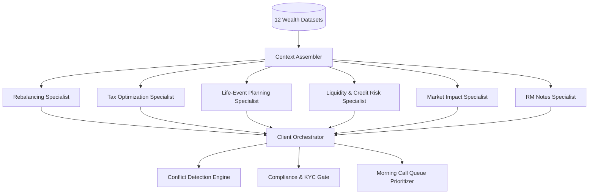
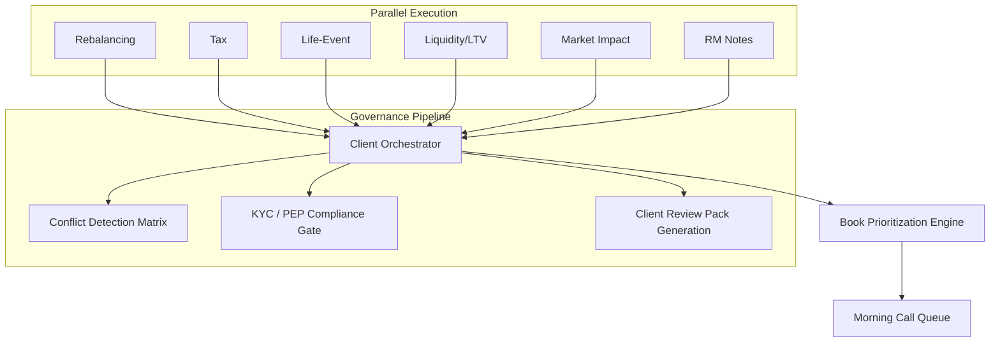

# Bank Julius Baer — Specialist Agents Skills & Capabilities Reference

## 0. Executive Architecture & Governance Philosophy

This document serves as the formal **Agent Roster, Personas, Deterministic Tool Signatures, Prompt Specifications, and Reasoning Contracts** powering the **Bank Julius Baer Wealth Intelligence Cockpit**.

```
┌──────────────────────────────────────────────────────────────────────────────────┐
│                           DETERMINISTIC COMPUTE LAYER                            │
│  (Pure Python — Math, Drift %, Concentration, LTV, Cash Runway, Tax Lots)        │
│  • Strictly Non-Hallucinatory                                                    │
│  • Point-in-Time Filtered (date <= snapshot_date)                                │
└────────────────────────────────────────┬─────────────────────────────────────────┘
                                         │ Fixed Numeric Facts & Citable Data
                                         ▼
┌──────────────────────────────────────────────────────────────────────────────────┐
│                       DYNAMIC LLM SPECIALIST AGENTS LAYER                        │
│  (Groq Llama-3.3-70B / LangChain / LangGraph Nodes)                              │
│  • Swiss Private Banking Personas & Domain Knowledge                             │
│  • Synthesizes Trade-offs, Explanations & Client-Ready Talking Points            │
└────────────────────────────────────────┬─────────────────────────────────────────┘
                                         │ Structured §6 Output Contract
                                         ▼
┌──────────────────────────────────────────────────────────────────────────────────┐
│                     ORCHESTRATION & COMPLIANCE SUITABILITY                       │
│  • Conflict Surfacing (Algorithmic Trade vs Standing RM Constraint)              │
│  • Regulatory Gate (KYC Review Date & PEP Protocols)                             │
│  • Composite Urgency Scoring & Morning Call Queue Generation                     │
└────────────────────────────────────────┬─────────────────────────────────────────┘
                                         │ Audited Actions & Briefs
                                         ▼
┌──────────────────────────────────────────────────────────────────────────────────┐
│                   RELATIONSHIP MANAGER (IN ABSOLUTE CONTROL)                     │
│  • 1-Click Traceable Audit Trail                                                 │
│  • In-Line Editable Talking Points & Advisory Phrasing                           │
│  • Approve / Modify / Reject Execution Gate                                      │
└──────────────────────────────────────────────────────────────────────────────────┘
```

---

## 1. Specialist Agent Directory & Skill Cards



---

### 1.1 Context Assembler (`ContextAssembler`)
*The Multi-Portfolio Entity Graph and Point-in-Time Constraint Aggregator*

- **Class Name:** `ContextAssembler` ([src/specialist_agents.py](file:///Users/avijit/Documents/Avi/Claude%20Code%20AI%20Hackathon/App%20Builder/src/specialist_agents.py#L23))
- **Primary Objective:** Constructs an immutable point-in-time client dossier and maps out the multi-portfolio entity hierarchy (`Client → Portfolios → Holdings`).
- **Client-Facing:** No (Internal foundation agent feeding all downstream specialists).
- **Core Skills & Responsibilities:**
  1. **Multi-Portfolio Entity Graph:** Resolves multiple sleeves belonging to a single client (e.g. Discretionary Mandate `PF-0001` vs Execution-Only Custody `PF-0002`), ensuring mandate rules are evaluated per sleeve without cross-portfolio contamination.
  2. **Point-in-Time RM Note Filtering:** Ingests unstructured meeting notes and filters them strictly where $\text{note\_date} \le \text{snapshot\_date}$ to prevent look-ahead leakage.
  3. **Standing Constraint Identification:** Scans notes for active negative constraints (e.g. "Do not sell legacy mining shares", "Averse to leverage").
  4. **KYC & PEP Regulatory Context Extraction:** Pulls KYC review due dates, PEP (Politically Exposed Person) flags, and reporting preferences.
- **Deterministic Tool Dependencies:**
  - `repo.get_client(client_id)`
  - `repo.get_portfolios_for_client(client_id)`
  - `analytics.get_rm_notes(client_id, as_of_date)`
- **Output Context Payload:**
  ```json
  {
    "client_id": "CL-0001",
    "client_name": "Hartono Wijaya Kusuma",
    "risk_profile": "Growth",
    "tax_domicile": "Singapore",
    "pep_status": "No",
    "kyc_review_due": "2026-11-30",
    "standing_overrides": [
      {
        "note_id": "N-001",
        "date": "2025-11-15",
        "summary": "Holds concentrated legacy shares; RM must consult client prior to rebalancing."
      }
    ],
    "portfolios": [...]
  }
  ```

---

### 1.2 Rebalancing Specialist Agent (`RebalancingAgent`)
*Multi-Asset Allocation, SAA Drift & Concentration Risk Specialist*

- **Class Name:** `RebalancingAgent` ([src/specialist_agents.py](file:///Users/avijit/Documents/Avi/Claude%20Code%20AI%20Hackathon/App%20Builder/src/specialist_agents.py#L124))
- **System Persona:** *Senior Portfolio Rebalancing Strategist at Bank Julius Baer.*
- **Confidence Tier:** `fact` 🔵
- **Domain Focus:**
  - Strategic Asset Allocation (SAA) drift against mandate target/min/max bounds.
  - Single-issuer and single-security concentration limits.
  - Structured product look-through exposure unbundling.
- **Deterministic Tool Dependencies:**
  - `compute_drift(portfolio_id, snapshot_date)`: Computes actual % vs mandate min/target/max bounds and exact dollar amounts to trim/add.
  - `compute_concentration(portfolio_id, snapshot_date)`: Detects single-stock/issuer weights exceeding `max_single_position_pct`.
  - `resolve_look_through(instrument_id)`: Unpacks multi-asset structured notes and worst-of barrier baskets into underlying constituent risks.
- **Reasoning Rules & Operational Skills:**
  1. **Strict Citation Rule:** Never recalculates raw percentages or drift amounts; cites deterministic math output directly.
  2. **Breach Classification:**
     - *Upper Breach:* Actual % > Max Band $\rightarrow$ Propose exact USD trim to target.
     - *Lower Breach:* Actual % < Min Band $\rightarrow$ Propose exact USD addition to target.
     - *Concentration Breach:* Position % > Mandate Cap $\rightarrow$ Propose de-risking trade.
  3. **Standing Override Cross-Check:** If an asset class or security proposed for trimming is flagged in `standing_overrides`, mark `compliance_status = "needs_review"` and cite the RM Note.
  4. **Tone:** Prestigious, articulate Swiss private banking tone suitable for ultra-high-net-worth (UHNW) advisory.

---

### 1.3 Tax-Aware Optimization Specialist Agent (`TaxOptimizationAgent`)
*Jurisdictional Tax Drag & Capital Loss Harvesting Specialist*

- **Class Name:** `TaxOptimizationAgent` ([src/specialist_agents.py](file:///Users/avijit/Documents/Avi/Claude%20Code%20AI%20Hackathon/App%20Builder/src/specialist_agents.py#L285))
- **System Persona:** *Senior Tax Structuring & Wealth Planning Specialist at Bank Julius Baer.*
- **Confidence Tier:** `rule` 🟣
- **Domain Focus:**
  - Tax domicile rules and cross-border withholding considerations.
  - Unrealized capital gain/loss lot analysis.
  - Tax-loss harvesting (TLH) opportunities to offset realized capital gains.
- **Deterministic Tool Dependencies:**
  - `compute_tax_lots(portfolio_id, snapshot_date)`: Computes cost basis, market value, unrealized PnL, holding duration, and taxable status.
- **Reasoning Rules & Operational Skills:**
  1. **Zero-Tax Jurisdictions:** For clients in Singapore, Hong Kong, UAE, and Swiss private accounts, confirms zero capital gains tax drag, enabling uninhibited rebalancing.
  2. **Taxable Jurisdictions:** For taxable jurisdictions (US, UK, Germany, Australia, etc.), scans for qualifying harvestable losses ($> \text{USD } 50,000$).
  3. **Wash-Sale & Reinvestment Awareness:** Recommends harvesting losses by switching to correlated alternative vehicles to preserve asset class exposure while locking in the tax deduction.

---

### 1.4 Life-Event Planning Specialist Agent (`LifeEventPlanningAgent`)
*Family Office Milestones, Succession & Cash Horizon Specialist*

- **Class Name:** `LifeEventPlanningAgent` ([src/specialist_agents.py](file:///Users/avijit/Documents/Avi/Claude%20Code%20AI%20Hackathon/App%20Builder/src/specialist_agents.py#L352))
- **System Persona:** *Family Office & Life-Event Advisory Director at Bank Julius Baer.*
- **Confidence Tier:** `fact` 🔵
- **Domain Focus:**
  - Planned liquidity outflows (real estate purchases, tax installments, tuition, philanthropic gifts).
  - Private equity capital commitment horizon.
  - Generational transition and wealth preservation vs accumulation alignment.
- **Deterministic Tool Dependencies:**
  - `repo.get_planned_cash_needs_for_client(client_id)`: Extracts planned milestone events, amounts, currencies, due dates, and certainty levels.
  - `repo.get_commitments_for_client(client_id)`: Evaluates uncalled fund commitments.
- **Reasoning Rules & Operational Skills:**
  1. **Liquidity Ring-Fencing:** Flags any milestone $> \text{USD } 500,000$ due within the next 6–12 months.
  2. **Market Timing Protection:** Recommends carving out a dedicated short-term liquidity buffer to avoid forced selling during market downturns.
  3. **Life-Stage Alignment:** Adapts talking points to the client's stated life stage (Wealth Accumulation, Preservation, or Inter-Generational Transfer).

---

### 1.5 Liquidity & Credit Risk Specialist Agent (`LiquidityCreditRiskAgent`)
*Lombard Lending Covenants, Margin Call Early Warning & Cash Runway Specialist*

- **Class Name:** `LiquidityCreditRiskAgent` ([src/specialist_agents.py](file:///Users/avijit/Documents/Avi/Claude%20Code%20AI%20Hackathon/App%20Builder/src/specialist_agents.py#L405))
- **System Persona:** *Chief Credit & Liquidity Risk Officer at Bank Julius Baer.*
- **Confidence Tier:** `fact` 🔵
- **Domain Focus:**
  - Lombard lending facilities, drawn balances, and collateral loanable values.
  - Margin call triggers, warning thresholds, and covenant proximity.
  - Liquidity runway and private fund capital call coverage.
- **Deterministic Tool Dependencies:**
  - `compute_ltv(client_id, snapshot_date)`: Computes current LTV %, margin call trigger %, buffer %, headroom USD, and critical flags.
  - `compute_liquidity_runway(client_id, snapshot_date)`: Reconciles total liquid pool (cash + credit headroom) against uncalled fund commitments and planned cash needs to calculate the Coverage Ratio.
- **Reasoning Rules & Operational Skills:**
  1. **LTV Margin Proximity Alerts:**
     - *Critical Breach ($< 2.0\%$ buffer):* Set `priority = "high"`, `compliance_status = "blocked"`, and propose immediate collateral injection or loan pay-down.
     - *Early Warning ($2.0\% - 5.0\%$ buffer):* Set `priority = "high"`, `compliance_status = "needs_review"`.
  2. **Capital Call Coverage Ratio Alerts:**
     - If $\text{Coverage Ratio} < 1.5\times$, issue a liquidity crunch warning.
  3. **Talking Points:** Professional, reassuring yet firm advisory phrasing emphasizing proactive collateral management before automated credit operations trigger.

---

### 1.6 Market & Event-Impact Specialist Agent (`MarketImpactAgent`)
*Macro Shock Transmission, Geopolitical Risk & Tactical Overlay Specialist*

- **Class Name:** `MarketImpactAgent` ([src/specialist_agents.py](file:///Users/avijit/Documents/Avi/Claude%20Code%20AI%20Hackathon/App%20Builder/src/specialist_agents.py#L488))
- **System Persona:** *Global Macro & Event Risk Strategist at Bank Julius Baer.*
- **Confidence Tier:** `model` 🟡
- **Domain Focus:**
  - Macroeconomic developments, central bank interest rate shifts, and geopolitical friction.
  - Direct transmission channels from world events to specific portfolio holdings.
  - Tactical downside protection, options collars, and defensive asset rotation.
- **Deterministic Tool Dependencies:**
  - `match_events_to_holdings(client_id, snapshot_date)`: Deterministically matches events from `event_log.csv` occurring on or before `snapshot_date` to portfolio holdings by region, asset class, and sector.
- **Reasoning Rules & Operational Skills:**
  1. **Strict Temporal Integrity:** Only analyzes events where $\text{event\_date} \le \text{snapshot\_date}$.
  2. **Transmission Analysis:** Articulates the exact causal chain (e.g. Red Sea shipping crisis $\rightarrow$ freight rates $\rightarrow$ energy/industrial equities).
  3. **Actionable Hedging:** Proposes structured yield overlays or protective puts to manage downside risk without triggering taxable liquidations.

---

### 1.7 RM Notes & Relationship Intelligence Specialist Agent (`RMNotesAgent`)
*Sentiment Analysis, Client Nuance & Standing Constraint Extractor*

- **Class Name:** `RMNotesAgent` ([src/specialist_agents.py](file:///Users/avijit/Documents/Avi/Claude%20Code%20AI%20Hackathon/App%20Builder/src/specialist_agents.py#L538))
- **System Persona:** *Relationship Intelligence & Client Sentiment Specialist at Bank Julius Baer.*
- **Confidence Tier:** `model` 🟡
- **Domain Focus:**
  - Unstructured meeting transcripts, call memos, and qualitative client instructions.
  - Sentiment shifts, family dynamics, and unwritten client preferences.
  - Standing constraints that override algorithmic portfolio recommendations.
- **Deterministic Tool Dependencies:**
  - `get_rm_notes(client_id, as_of_date)`: Extracts timestamped notes where $\text{date} \le \text{as\_of\_date}$ and segments them into `standing_overrides`, `preferences`, and `recent_notes`.
- **Reasoning Rules & Operational Skills:**
  1. **Standing Constraint Extraction:** Detects explicit client vetoes (e.g., ESG restrictions, reluctance to trim founder stock, aversion to leverage).
  2. **Inter-Agent Override Propagation:** Injects extracted constraints into the multi-agent graph as standing modifiers.
  3. **Sentiment Contextualization:** Provides RMs with behavioral context to tailor the advisory meeting tone.

---

## 2. Orchestration, Governance & Book Prioritization



### 2.1 Per-Client Orchestrator (`ClientOrchestrator`)
- **Class Name:** `ClientOrchestrator` ([src/orchestrator.py](file:///Users/avijit/Documents/Avi/Claude%20Code%20AI%20Hackathon/App%20Builder/src/orchestrator.py#L17))
- **Responsibilities:**
  1. **Parallel Specialist Execution:** Invokes all 6 specialist agents with point-in-time context.
  2. **Cross-Agent Conflict Detection:** Detects contradictions between quantitative recommendations and qualitative constraints:
     - *Conflict Type 1:* Rebalancing Agent proposes trimming an asset class, but RM Notes contain a family holding restriction.
     - *Conflict Type 2:* Market Dip-Buying recommendation conflicts with Lombard loan margin call risk.
     - Automatically attaches conflict IDs and explanatory rationale to the affected recommendations.
  3. **Comingling & Strategic Action Clubbing Engine:**
     - Discovers cross-specialist execution synergies where discrete actions can be commingled into a single high-value strategy (e.g. Equity Concentration Trim $\leftrightarrow$ Tax-Loss Shield $\leftrightarrow$ Cash Buffer Fortification $\leftrightarrow$ Life Milestone Pre-Funding).
     - Generates unified multi-objective execution packages with synchronized 1-click approval.
  4. **Compliance & Suitability Gate:**
     - Checks overdue KYC review dates ($\text{kyc\_review\_due} < \text{snapshot\_date}$).
     - Checks PEP (Politically Exposed Person) enhanced due diligence status.
     - Flags unapproved investment recommendations before RM review.

### 2.2 Book Prioritization Engine (`BookPrioritizer`)
- **Class Name:** `BookPrioritizer` ([src/orchestrator.py](file:///Users/avijit/Documents/Avi/Claude%20Code%20AI%20Hackathon/App%20Builder/src/orchestrator.py#L180))
- **Urgency Scoring Formula ($0 - 100$):**
  $$\text{Urgency Score} = \min\Big(100,\; S_{\text{LTV}} \times 0.35 + S_{\text{Mandate}} \times 0.30 + S_{\text{Liquidity}} \times 0.25 + S_{\text{Life}} \times 0.10\Big)$$
  - $S_{\text{LTV}}$: Proximity to Lombard margin call (Score 40–100 if buffer $< 5\%$).
  - $S_{\text{Mandate}}$: Asset class drift and single-stock concentration breaches (Score 25 per high breach).
  - $S_{\text{Liquidity}}$: Shortfall in capital call coverage ratio (Score 30 if coverage $< 1.5\times$).
  - $S_{\text{Life}}$: High-certainty liquidity needs due within 6 months (Score 20 per event).
- **Output:** Generates the **Morning Call Queue** ranked descending by urgency.

---

## 3. Deterministic Analytics Engine — Tool Signatures

All specialist agents consume facts strictly generated by pure Python functions in `DeterministicAnalytics` ([src/deterministic_analytics.py](file:///Users/avijit/Documents/Avi/Claude%20Code%20AI%20Hackathon/App%20Builder/src/deterministic_analytics.py)):

| Function Signature | Description | Return Type |
| :--- | :--- | :--- |
| `compute_drift(portfolio_id, snapshot_date)` | Calculates actual asset class weights vs mandate target/min/max bands. | `Dict[str, Any]` (contains `breaches`, `current_weights`, `is_compliant`) |
| `compute_concentration(portfolio_id, snapshot_date)` | Identifies single positions or issuers exceeding mandate concentration caps. | `Dict[str, Any]` (contains `single_breaches`, `max_weight_pct`) |
| `resolve_look_through(instrument_id)` | Unpacks structured products and derivatives into underlying constituent exposures. | `Dict[str, Any]` (underlying tickers, weights, structure type) |
| `compute_ltv(client_id, snapshot_date)` | Calculates loan balances, collateral lending values, current LTV %, margin call buffers, and headroom. | `Dict[str, Any]` (contains `facilities`, `margin_call_warnings`, `total_headroom_usd`) |
| `compute_liquidity_runway(client_id, snapshot_date)` | Compares liquid cash pools and credit headroom against private capital calls and cash needs. | `Dict[str, Any]` (contains `coverage_ratio`, `urgency`, `runway_months`) |
| `compute_tax_lots(portfolio_id, snapshot_date)` | Evaluates cost basis, unrealized PnL, holding duration, and tax-loss harvesting potential. | `Dict[str, Any]` (contains `total_harvestable_losses_usd`, `is_zero_cap_gains`) |
| `match_events_to_holdings(client_id, snapshot_date)` | Correlates macro events ($\le \text{snapshot\_date}$) to portfolio holdings via sector/asset class channels. | `List[Dict[str, Any]]` (contains `description`, `transmission`, `total_exposed_usd`) |
| `get_rm_notes(client_id, as_of_date)` | Point-in-time extraction of RM notes, standing overrides, and client preferences. | `Dict[str, Any]` (contains `standing_overrides`, `preferences`, `recent_notes`) |

---

## 4. Standard §6 Recommendation Contract

Every specialist agent outputs recommendations conforming to the following typed schema:

```json
{
  "id": "REC-REB-7F06C5",
  "client_id": "CL-0001",
  "portfolio_id": "PF-0001",
  "portfolio_name": "Core Discretionary Mandate",
  "agent": "rebalancing",
  "priority": "high",
  "confidence_tier": "fact",
  "headline": "Concentration breach: Global Developed Equity Index Fund represents 26.6% of portfolio (limit 15.0%)",
  "evidence": [
    {
      "source_function": "compute_concentration",
      "detail": "Single security holding is 26.6% (cap is 15.0%)",
      "as_of_date": "2026-03-31",
      "threshold_or_band": "Max Single Position 15.0%",
      "raw_metric_value": 26.6
    }
  ],
  "recommendation": "De-risk position by reducing USD 4,008,126 to comply with single-issuer concentration guidelines.",
  "talking_point": "Due to recent market movements, Global Developed Equity Index Fund now accounts for 26.6% of your portfolio, surpassing our risk governance cap of 15.0%. We recommend prudent partial profit-taking.",
  "conflicts_with": ["REC-NOTE-9E2B1A"],
  "compliance_status": "needs_review",
  "compliance_reason": "RM note constraint detected on legacy/asset class holdings",
  "rm_note_influence": "RM Note Alert: 'Did not want to discuss reducing the legacy shareholding...'"
}
```

### Confidence Tier Badges

| Tier | Badge | Meaning | Audit Source |
| :--- | :---: | :--- | :--- |
| **`fact`** | 🔵 `fact` | Pure mathematical calculation | Produced directly by deterministic Python analytics (Drift %, Concentration %, LTV, Cash Runway). |
| **`rule`** | 🟣 `rule` | Documented regulatory / tax rule | Derived from investment mandate codes, KYC rules, or jurisdictional tax codes. |
| **`model`** | 🟡 `model` | LLM reasoning & semantic inference | Synthesized by dynamic LLM agents from unstructured notes or macro event logs. |

---

## 5. UI Integration & RM Control Flow

1. **Morning Call Queue:** Displays prioritized client dossiers with composite urgency scores, primary driver badges, and quick-action triggers.
2. **Client 360 & Multi-Portfolio Intelligence:** Interactive breakdown of total AUM, asset class drift bars, structured product look-through unbundling, Lombard LTV metrics, and point-in-time RM notes.
3. **Agent Action Deck:** Filtered sub-tabs (`All`, `High Priority`, `Medium Priority`, `Low Priority`) displaying structured recommendations, evidence audit trails, editable verbatim talking points, and 1-click RM Approve / Modify / Dismiss buttons.
4. **Client Meeting Pack Generator:** Generates branded, formal briefing packs and personalized client emails for Priscilla Ong.
5. **Semantic Knowledge Navigator:** Real-time semantic vector query interface across meeting notes, event logs, and mandate clauses.
